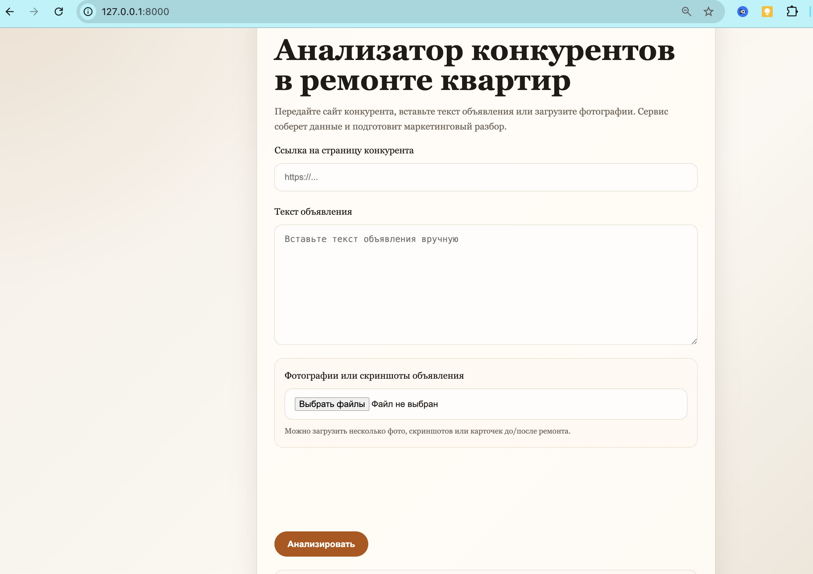
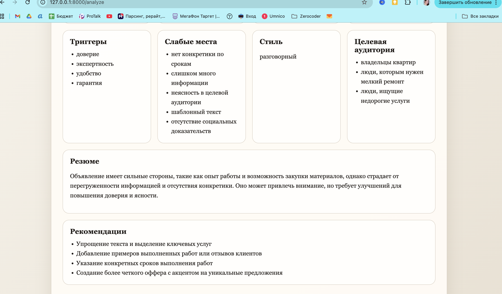

# 🛠 Avito Analyzer  
AI-анализатор объявлений конкурентов в нише ремонта квартир

Локальный веб-сервис, который анализирует объявления конкурентов (например Avito) и делает маркетинговый разбор.

Сервис может анализировать:

- текст объявления
- фотографии объявления
- страницу сайта конкурента

После анализа формируется структурированный отчёт.

---

# 🚀 Возможности

Сервис выполняет:

### Анализ текста объявления
Определяет:

- основную услугу
- дополнительные услуги
- ценовую модель
- преимущества
- маркетинговые триггеры
- слабые места объявления
- стиль текста
- целевую аудиторию
- итоговое резюме
- рекомендации по улучшению

---

### Анализ изображений

Модель анализирует фотографии объявления:

- что изображено
- стадия ремонта
- виды работ
- качество визуальной подачи
- сигналы доверия
- слабые стороны фотографий

---

# 🧠 Для чего нужен проект

Проект помогает:

- анализировать конкурентов
- понимать маркетинговые стратегии объявлений
- выявлять слабые места
- улучшать собственные объявления

Особенно полезно для:

- ремонтных компаний
- маркетологов
- специалистов по продвижению услуг

---

# 🏗 Архитектура проекта

avito_analyzer/
├── config.py
├── main.py
├── requirements.txt
├── services/
│ ├── openai_analyzer.py
│ ├── selenium_parser.py
│ └── text_cleaner.py
├── static/
│ └── style.css
└── templates/
├── index.html
└── result.html

---

# ⚙️ Технологии

- Python
- FastAPI
- OpenAI API
- Selenium
- HTML / CSS
- Jinja2 templates

---

# ▶️ Как запустить проект

### 1. Клонировать репозиторий

git clone https://github.com/Tata-Tiana/avito-analyzer.git

Перейти в папку проекта:

cd avito-analyzer

---

### 2. Создать виртуальное окружение

python3 -m venv .venv

Активировать:

Mac / Linux

source .venv/bin/activate

Windows

.venv\Scripts\activate

---

### 3. Установить зависимости

pip install -r requirements.txt

---

### 4. Создать `.env`

Создать файл:

.env

Добавить ключ:

OPENAI_API_KEY=your_openai_api_key

---

### 5. Запустить сервер

uvicorn main:app --reload

После запуска приложение доступно по адресу:

http://127.0.0.1:8000

---

# 📊 Как пользоваться

Можно передать данные тремя способами:

1️⃣ URL сайта конкурента  

2️⃣ текст объявления (например Avito)

3️⃣ фотографии или скриншоты объявления

После этого сервис:

- собирает данные
- анализирует текст
- анализирует изображения
- формирует отчёт

---

# ⚠️ Особенности

Из-за анти-бот защиты Avito автоматический парсинг может работать нестабильно.

Поэтому объявления Avito удобнее анализировать через:

- ручную вставку текста
- загрузку фотографий объявления

---

# 💡 Возможные улучшения

Можно добавить:

- анализ нескольких объявлений одновременно
- сравнение конкурентов
- генерацию улучшенного объявления
- рекомендации по SEO
- экспорт отчёта

---

# Интерфейс

# 👩‍💻 Автор

Учебный проект по анализу конкурентов в сфере ремонта квартир.

Разработано с использованием **Cursor AI и vibe-coding подхода**.
